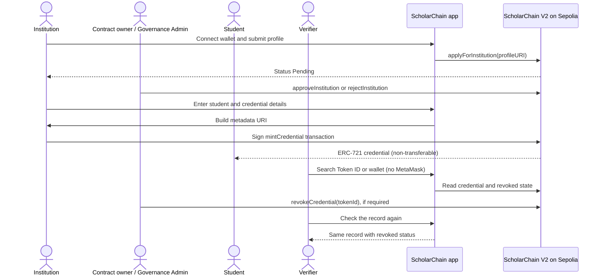

# ScholarChain System Workflows

ScholarChain is an academic prototype deployed against the **Ethereum Sepolia Testnet**. It demonstrates **decentralized verification with permissioned issuer governance**. Institution and credential records are read from the contract; institution applications, approvals, credential issuance and revocations are signed transactions.

## Role matrix

| Role | Wallet needed? | Capabilities in the current app |
| --- | --- | --- |
| Governance Admin | Yes; the contract owner wallet on Sepolia | Approves or rejects pending institutions, suspends or reactivates institutions, and revokes credentials. |
| Institution applicant | Yes; the applicant institution wallet | Submits an institution profile. The application is recorded as Pending. |
| Approved Institution / issuer | Yes; its approved wallet | Issues credentials to student wallet addresses and reviews its issued credentials. |
| Student / credential holder | Connects a wallet to use My Credentials | Views credentials owned by the connected address. Does not sign the issuance transaction. |
| Public verifier | No | Looks up a Token ID or a public wallet address using the public Sepolia RPC. |

Governance is permissioned: the contract uses an owner account for privileged decisions. Public verification is independently readable; the app does not claim fully decentralized governance.

## Institution workflow

1. The institution connects its wallet through the app. Contract-changing actions require MetaMask (or a compatible injected wallet) and Sepolia.
2. It submits its profile. The current UI builds profile JSON as a base64 data URI by default; an advanced manual profile URI can be supplied instead.
3. `applyForInstitution` records the profile URI and sets the institution status to **Pending**. The institution can see its status on the application page.
4. The contract owner reviews the pending institution in the Admin portal and submits either `approveInstitution` or `rejectInstitution`.
5. **Approved** status permits the institution wallet to call `mintCredential`. **Rejected** institutions cannot mint. The owner can later **Suspend** an approved institution to stop future issuance or **Reactivate** a suspended institution.

## Credential issuance and student workflow

1. An approved institution opens Issue Credential and enters the student's Ethereum address, institution credential serial/reference (`credentialId`), achievement title and credential category. Optional fields are included in the metadata builder.
2. By default, the frontend builds JSON metadata and encodes it into a `data:application/json;base64,...` URI. The institution may instead provide a manual metadata URI, including an IPFS URI. The contract stores the URI; the metadata content is not inherently hosted on IPFS.
3. The institution reviews and signs the mint transaction. The signer pays the transaction gas in Sepolia ETH.
4. The contract allocates the next numeric Token ID, mints the ERC-721 to the student address, stores credential fields and the metadata URI, and emits `CredentialMinted`. It rejects duplicate credential serials.
5. The app displays the transaction hash and links to Sepolia Etherscan. The student connects the receiving wallet and opens My Credentials to query tokens held by that address. No automatic notification or wallet push is implemented.

## Verifier workflow

1. Anyone can open Verify without connecting MetaMask.
2. The verifier enters a numeric Token ID or an Ethereum wallet address.
3. The frontend uses a configured public Sepolia JSON-RPC provider to read the contract and, where available, resolve metadata from its URI.
4. The result displays the issuer, credential details and current revoked/valid flag. This proves that the approved issuer wallet recorded the data and shows the contract's current state; it does **not** prove that the student deserved the qualification or independently validate the issuer's underlying academic decision.

## Governance workflow

- The app identifies the Governance Admin by comparing the connected address with `owner()` from the V2 contract.
- Only the contract owner can approve/reject/suspend/reactivate institutions and revoke credentials.
- Revocation sets a boolean flag and emits `CredentialRevoked`; it does not burn the ERC-721 or erase the credential record. Lookup continues to show the record as revoked.
- Suspending an institution stops future minting while preserving its prior credential history. Reactivation returns a suspended institution to Approved.

## Credential lifecycle

## Definitions

| Term | Meaning in this app |
| --- | --- |
| Wallet / student wallet | An Ethereum address. The student address receives the token; a wallet app controls signing when the student performs wallet actions. |
| ERC-721 token | The contract's NFT-style credential record, named `ScholarChain Credential` (`SCRED`). Its Token ID is the numeric on-chain identifier. |
| Soulbound | Transfers between user wallets are rejected by the contract. Minting to a student and burning are allowed by the transfer hook, but this app's revocation action only flags the record; it does not burn it. |
| Token ID | Numeric identifier assigned by the contract when a credential is minted. Used for direct lookup. |
| Credential ID | Institution-provided serial/reference string. The contract requires it to be unique across credentials. It is distinct from Token ID. |
| Transaction hash | Identifier of the signed blockchain transaction, such as the mint transaction; the UI links it to Sepolia Etherscan. |
| Metadata URI | URI stored as the ERC-721 token URI and returned with the credential. By default it points to inline base64 JSON; issuers can supply another URI such as `ipfs://...`. |
| IPFS | A content-addressed storage network that can be used for profile/credential metadata or artwork. It is optional for credential metadata in the current mint UI. |
| Institution profile | JSON fields submitted by the institution and referenced from the contract by `profileURI`; it describes the applicant/issuer and is not itself the credential. |
| Revoked | An on-chain flag marks a minted credential invalid for verification. The record and token remain queryable for audit history. |
| Institution status | Contract enum: Not registered, Pending, Approved, Rejected or Suspended. |
| Sepolia | Ethereum's test network used by this prototype. Test ETH is used for transaction gas; records here are demo/testnet records. |
